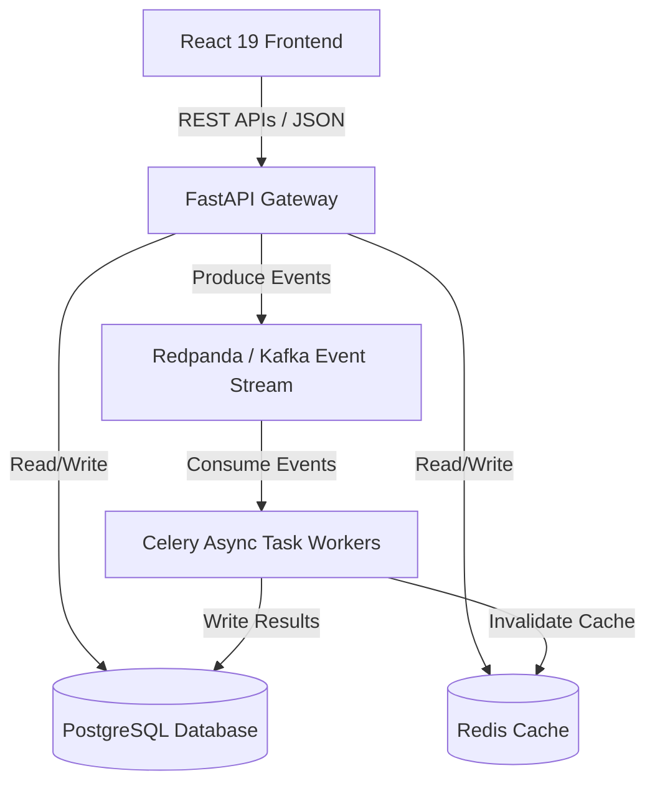

# Architecture Documentation

This document describes the high-level system architecture and data flows of the Cyber Threat Intelligence (CTI) Platform.

## System Topology

## Data Pipeline Flow
1. **SIEM / EDR Ingestion**: Remote log sources push to API or are pulled by Celery tasks.
2. **Security Data Lake Ingestion**: Records normalized into structured schema registry and saved in partitioned storage.
3. **Correlation Engine**: Real-time correlation loops mapping patterns to ATT&CK matrix.
4. **AI Platform**: Grounded RAG document query retrieving evidence contexts before returning prompt responses.
